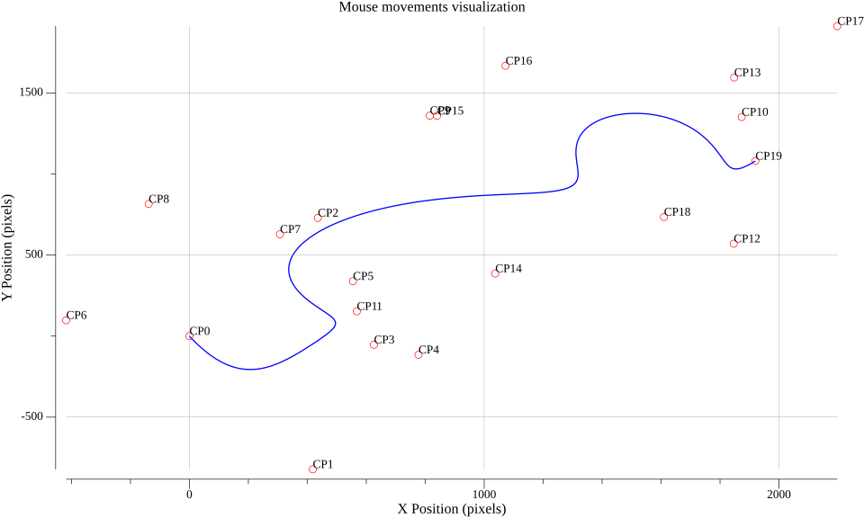
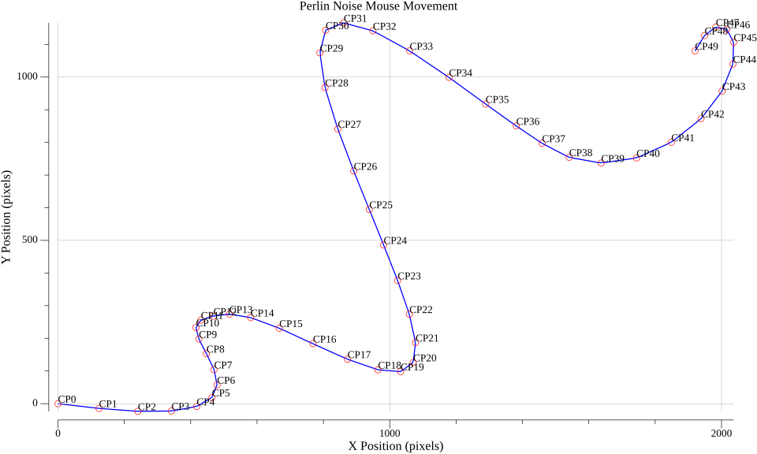

<div align="center">

# 🖱️ mimic

**Human-like mouse movement generation for Go.**

Generate natural, curved cursor trajectories using pluggable algorithms instead of robotic straight lines.

[](https://pkg.go.dev/github.com/combo23/mimic)
[](https://goreportcard.com/report/github.com/combo23/mimic)
[](LICENSE)


</div>

---

## Overview

**mimic** is a Go library for generating human-like mouse movements. Real users never move the cursor in a perfectly straight line at constant speed — they curve, drift, accelerate, and hesitate. `mimic` reproduces that behavior through configurable, algorithm-driven path generation.

Each generated movement is a sequence of timestamped points, making it suitable for automation, UI testing, and simulating realistic human input.

## Features

- **Multiple algorithms** — Bézier curves and Perlin noise, selectable at runtime.
- **Configurable realism** — tune noise, speed, control points, and resolution.
- **Per-point timing** — every point carries a `time.Duration` for accurate playback.
- **Simple interface** — one `Mimic` interface, one method: `GenerateMovement`.
- **Zero runtime dependencies** — visualization tooling is confined to tests only.

## Installation

```bash
go get github.com/combo23/mimic
```

Requires Go 1.23 or later.

## Quick Start

```go
package main

import (
	"fmt"

	"github.com/combo23/mimic"
	"github.com/combo23/mimic/models"
)

func main() {
	opts := models.MovementOptions{
		StartPoint:    models.Point{X: 0, Y: 0},
		EndPoint:      models.Point{X: 1920, Y: 1080},
		NoiseLevel:    1,
		Resolution:    models.Point{X: 1920, Y: 1080},
		ControlPoints: 20,
		Speed:         1000,
	}

	m := mimic.NewMimic(mimic.BezierAlgorithm)
	movement := m.GenerateMovement(opts)

	for _, p := range movement.Points {
		fmt.Println(p.String()) // (x, y) took <duration>
	}
}
```

## API

### Selecting an algorithm

```go
m := mimic.NewMimic(mimic.BezierAlgorithm) // or mimic.PerlinAlgorithm
```

| Algorithm | Constant | Description |
|-----------|----------|-------------|
| Bézier curve | `mimic.BezierAlgorithm` | Smooth, intentional paths via control points. |
| Perlin noise | `mimic.PerlinAlgorithm` | Organic, gently wandering paths. |

### `MovementOptions`

| Field | Type | Description |
|-------|------|-------------|
| `StartPoint` | `models.Point` | Starting coordinates. |
| `EndPoint` | `models.Point` | Target coordinates. |
| `NoiseLevel` | `float64` | Amount of randomness (`0.0`–`1.0`). |
| `Resolution` | `models.Point` | Screen resolution (width × height). |
| `ControlPoints` | `int` | Number of control points for the Bézier curve (min `2`). |
| `Speed` | `float64` | Movement speed in pixels per second. |

### Return value

`GenerateMovement` returns a `*models.Movement`:

```go
type Movement struct {
	Points        []Point // the generated path, each with X, Y, and Timing
	ControlPoints []Point // control points used to shape the path
}
```

## Supported Algorithms

### [Bézier curve](https://en.wikipedia.org/wiki/B%C3%A9zier_curve)

Produces smooth, deliberate trajectories shaped by a configurable number of control points.



### [Perlin noise](https://en.wikipedia.org/wiki/Perlin_noise)

Produces organic, naturally wandering paths driven by gradient noise.



## Testing

```bash
go test -race ./...
```

The `tests` package also renders movement visualizations (the images above) using [gonum/plot](https://github.com/gonum/plot).

## Contributing

Contributions are welcome! Please open an issue for feature requests and bug reports, or submit a pull request.

## License

Released under the [MIT License](LICENSE).
