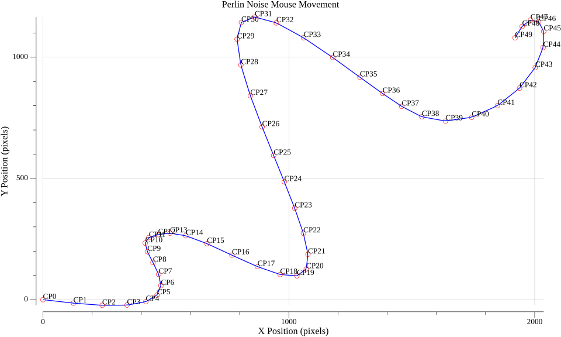

# mimic

Mimic is a Go library for generating human-like mouse movements based on various algorithms.

## Installation

```bash
go get github.com/combo23/mimic
```

## Usage

~~~go
package main

import (
	"fmt"
	"time"

	"github.com/combo23/mimic"
	"github.com/combo23/mimic/types"
)

func main() {
	opts := types.MovementOptions{
		StartPoint:    types.Point{X: 0, Y: 0},
		EndPoint:      types.Point{X: 1920, Y: 1080},
		NoiseLevel:    1,
		Resolution:    types.Point{X: 1920, Y: 1080},
		ControlPoints: 20,
		Speed:         1000,
	}

	mimic := mimic.NewMimic(mimic.BezierAlgorithm)
	mimic.GenerateMovement(opts)
	mimic.AddHesitation(0.1, 100*time.Millisecond)
	movement := mimic.AddAcceleration(0.8, 1.2)

	fmt.Println(movement)
}
~~~

## Supported algorithms

-[Bézier curve](https://en.wikipedia.org/wiki/B%C3%A9zier_curve)


-[Perlin Noise](https://en.wikipedia.org/wiki/Perlin_noise)



## Contributing

Contributions are welcome! For feature requests and bug reports please submit an issue!